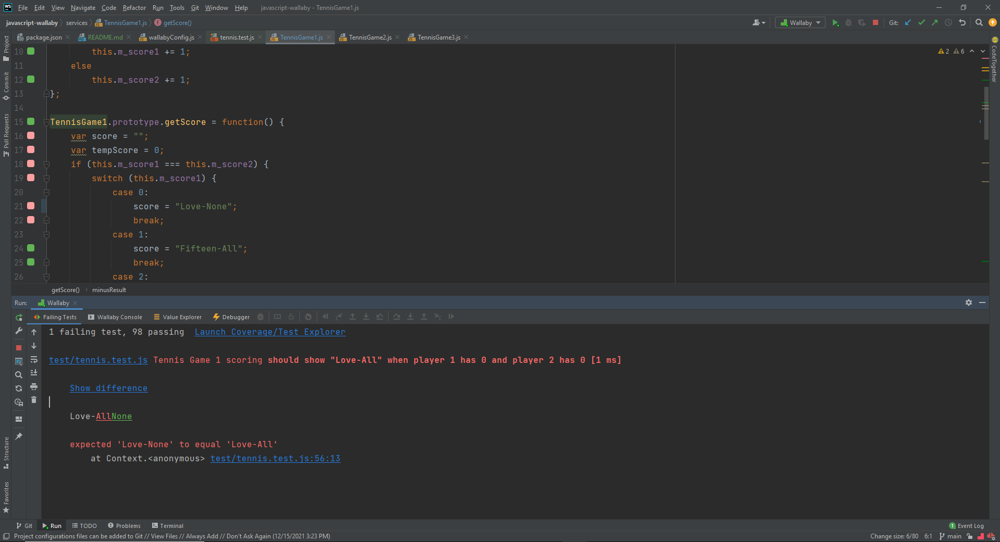

## How to Run Tests

1. From this `javascript-wallaby` directory, on the command line run `npm i`
2. Add the [Wallaby](https://wallabyjs.com/) extension to your IDE 
3. If needed, generate the Wallaby trial license here: https://wallabyjs.com/download/
4. Use the trial license to run the tests continuously via the [Wallaby](https://wallabyjs.com/) extension

